# 方块电玩：机器交互参考图集

整理日期：2026-09-30。配套主文档：[机器制作与交互标准](机器制作与交互标准.md)。

12 张原图已融入主文档各功能章节，制作时直接阅读主文档即可对照完整要求；本页是按原图序检索的补充索引，不是另一份必须来回查阅的规范。

这 12 张图由用户按顺序提供，作为制作新机器、补齐现有附属的外观和操作界面基准。主文档已包含目标外观、完整操作、距离、权限、存档归属、设备类型差异和验收清单；本页保留逐图说明与原始资料关系。

原图按 01～12 原顺序保存于 [参考图目录](reference-images/machine-interaction-20260930/)，未裁切、重绘或压缩，不依赖临时剪贴板文件。它们是用户指定的设计参考，不是任何新版本的测试截图，也不证明具体机型已经通过验收。

## 使用约定

- 同类家用机统一操作入口、界面分组、状态说明和按钮含义；机壳、手柄按键、介质外形、接口及封面比例按机型适配，图中的 FC 是效果示例，不是所有机器的固定外形。
- 图中的玩家名、坐标、游戏名、封面、ROM 标识及槽位名称只是现场示例，不作为默认数据写进模组。参考截图不等于取得图内第三方素材的独立再分发许可；不把截图当作游戏贴图或随 JAR 打包的素材。
- 截图内的文字截断、临时标签和禁用状态不能直接当成新规范。长名称应可查看完整内容；不支持的功能须标明原因，不能做假按钮。
- 一张静态图只能说明构图和某个状态，不能代替动画、切换、多人同步、保存成功的实机验收。
- 编号不因标题校正而改变：**08 实际是封面页，不是存档页；11 实际是选择存档页，截图里三个槽都为空。**“有进度时如何继续”按主文档和第 11 节另外验收，不把空槽写成已保存。

## 参考图顺序与制作内容

| 图号 | 参考内容 | 主要检查 |
| --- | --- | --- |
| 01 | 第一人称 1P 手持手柄 | 双手姿势、比例、按键可见、手柄线 |
| 02 | 放置机器与电源灯 | 落地位置、实体部件、卡带、电源状态 |
| 03 | 对准按键的提示 | 命中位置、当前动作、短提示 |
| 04 | 第三人称持握 | 双手动作、旁人所见、动态手柄线 |
| 05 | 家用机视频接线 | 两端插头、完整线材、自然走线 |
| 06 | 卡带外观与提示 | 实体封面、游戏名称、插卡／编辑／存档说明 |
| 07 | 拷卡工作台 | 游戏列表、预览、写入、封面／存档入口 |
| 08 | 封面设置页 | 同一工作台切页、选择、清空／恢复、应用 |
| 09 | 存档方式设置 | 不存档／卡带／个人，作用于当前卡 |
| 10 | 存档库 | 真实进度列表、详情、改名、确认删除 |
| 11 | 开局选择存档 | 槽位、新开／继续、命名、按键设置 |
| 12 | 家用机设备设置 | 模式、使用者／加入设置、性能／网络／私人入口 |

## 01 · 第一人称：1P 玩家手持手柄

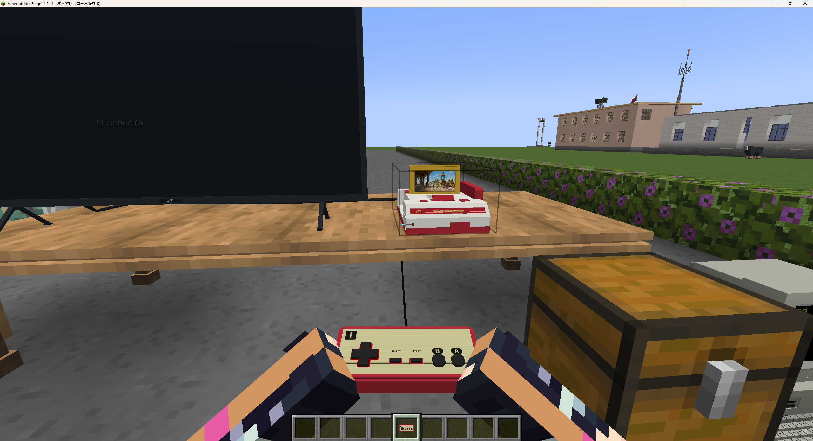

参考要点：手柄位于画面下方中央，双手从两侧持握，正面略向玩家倾斜；能辨认 1P 标识、方向键、Select、Start 和 A/B。线从手柄连回所属主机，而不是凭空结束。

制作与验收：

- 手柄不能小到看不清，也不能挡住主要电视画面；主手、副手和不同玩家皮肤下姿势都自然。
- 所领手柄与主机型号、1P/2P 端口一致；按键映射和按下动画另做动态检查，不能仅贴一张手柄图片。
- 没开机也允许领取实体手柄；图中的黑屏不是“拿到手柄就必须开游戏”的依据。领取、取得游戏控制、归还遵守主文档第 4 节。

## 02 · 机器放置：实体部件与电源灯

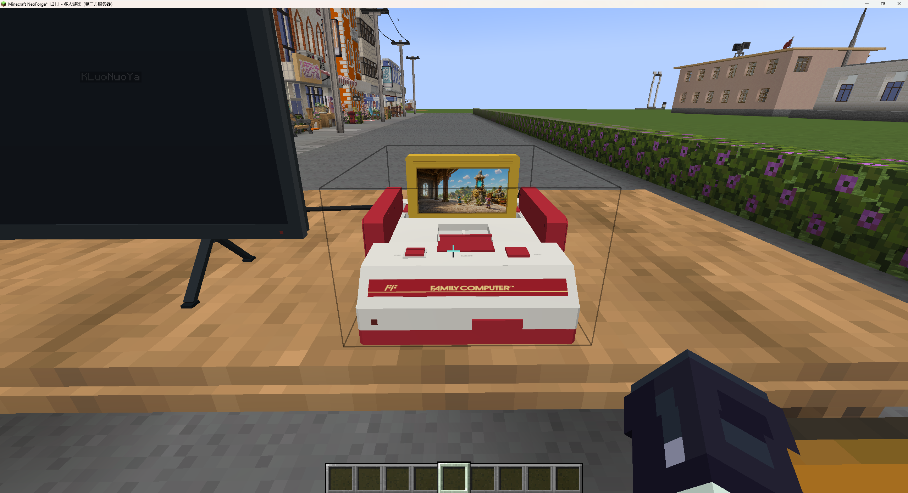

参考要点：主机稳当地放在桌面，卡带插在真实卡槽里且封面可见；电源、RESET、退卡结构及手柄收纳位置可辨认，机身有独立电源灯。

制作与验收：

- 四朝向下不悬浮、不埋桌；按钮、接口、卡槽与点击区域一起转。插卡／空槽、手柄在位／取走都有真实外观差异。
- 指示灯跟随实际电源状态，而不是谁正在拿手柄。家用机红／绿状态规则见主文档；本图只作灯的位置和整体外观参考，不证明切换效果。
- 拿走卡带后不能还画着假卡；其他机型保留自己的体积、部件布局和颜色，不复制 FC 外壳。

## 03 · 对应按键：准星指向时有提示

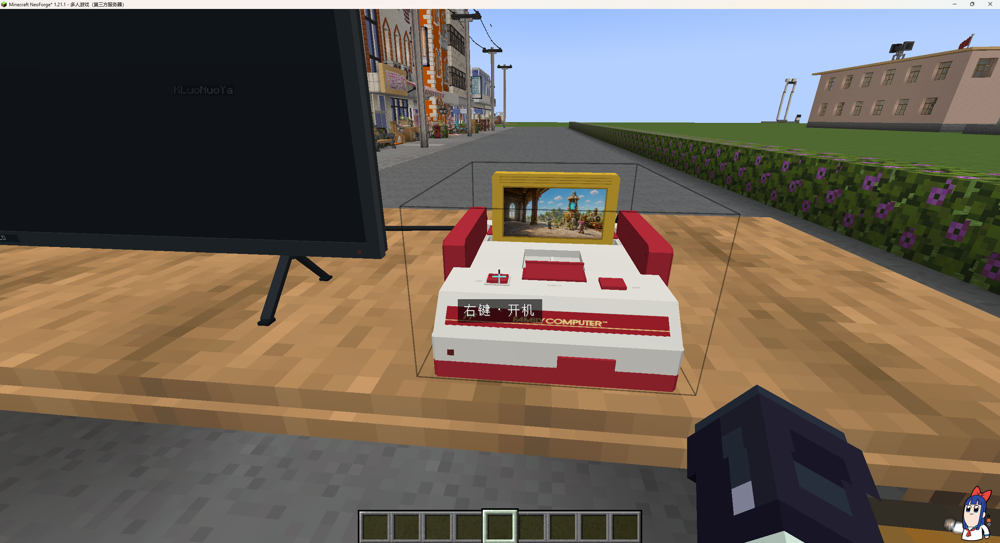

参考要点：对准实际电源键，显示简短的深色半透明提示“右键 · 开机”。玩家不必猜哪一块外壳能点。

制作与验收：

- 提示与真实命中区一致，移开后消失；按当前状态显示开机／关机，RESET、取还手柄、插拔等可交互部件显示对应动作。
- 使用玩家实际按键绑定的名称；不要提示右键开机，实际却打开选游戏或调试页。
- 提示短、易读，不每次瞄准都发聊天消息；并排设备、侧面观察时不串到另一台机器。容差不绕过墙体和实体遮挡。

## 04 · 第三人称：手持姿势和动态线

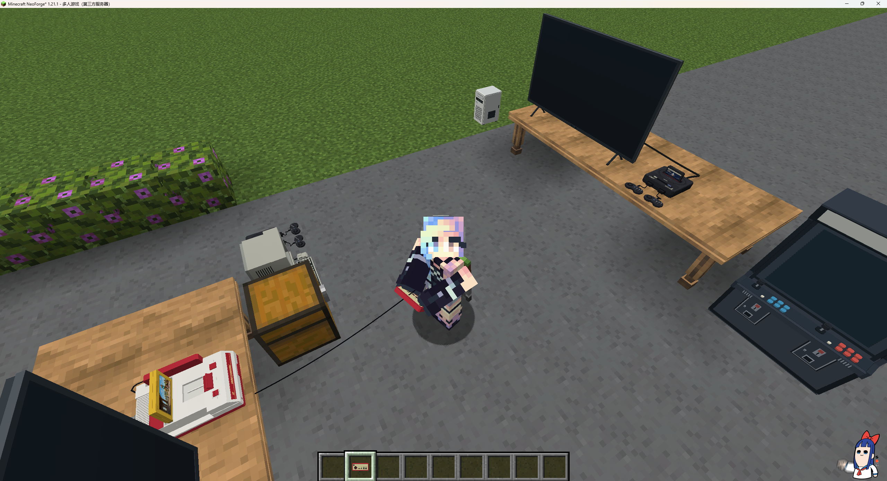

参考要点：人物两臂在身前围住手柄，不是单手拿工具；从第三人称仍能看见连到正确主机的手柄线。

制作与验收：

- 自己切 F5、另一位玩家旁观，都看到对应型号、端口和双手姿势；不能只做好本人的第一人称。
- 移动、转头、主副手变化后线仍跟随真实持握点，取走后原收纳位为空，归还恢复。
- 按键按下／松开、取还动作与其他玩家所见一致；静态图只确定姿势，动画效果要运行时检查。超距、归还、失效后不留线或姿势。

## 05 · 家用机接线：连接成功必须看得见

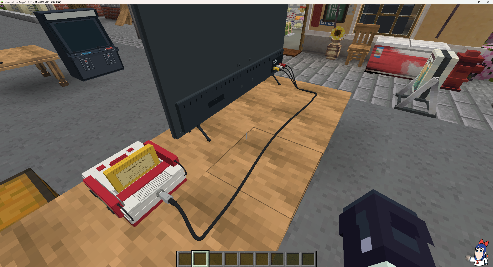

参考要点：主机后部插头贴合接口，黑色线材沿桌面自然弯曲；电视背部黄／白／红三个插头分支后汇成一根线。两端和中段是完整的可见连接。

制作与验收：

- 不接受“提示连接成功，但完全看不到线”。插头、分支、线材应在相关玩家视角正确显示，重进区块或服务器也不消失。
- 复用公共接线和线材表现，适配机型端点；图中主机端同轴外观只是示例，各机型和电视按实际接口表现。
- 桌面、壁挂、主机在接口正下方、四朝向均检查，不穿机身正面、不悬空起飞、不无故绕圈。
- 成功扣一份线，拆线正确返还，断开后渲染消失；8 格连接上限与手柄 6 格范围分开。街机背面底部通讯线是另一项，不照搬此走线。

## 06 · 卡带：能看见封面，也能看懂用途

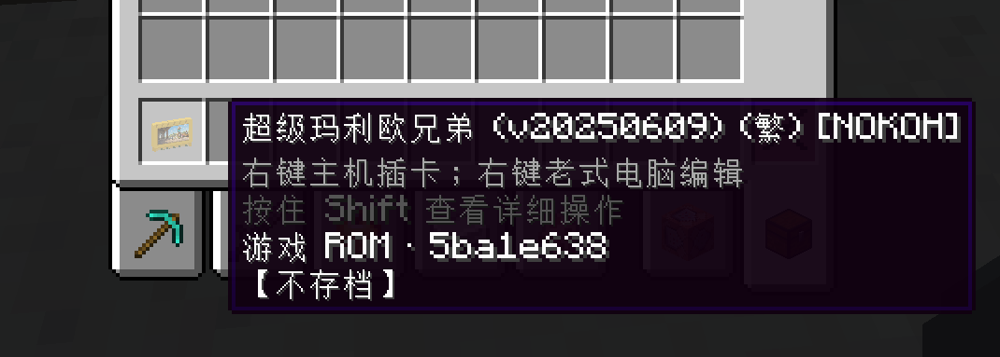

参考要点：物品栏里的卡带有外壳和可辨认封面；提示依次显示游戏名称、右键主机插卡／右键老式电脑编辑、Shift 详细操作、ROM 简短标识及当前“不存档”状态。

制作与验收：

- 图标、手持和插进主机后的卡带显示同一张实际封面，不是所有游戏共用一张占位图；未设置封面时允许明确的默认卡面。
- 名称是玩家可读的游戏名，身份校验不依赖这个名称；改名、改封面不改变游戏或进度归属。
- 提示包含当前保存方式；确实保存成功才显示已有进度，不把选择了“卡带存档”等同于已经保存。
- 图中黄色外壳只是本机型参考，其他设备使用自己的介质外观；正式名称说明介质和用途，不用“私人模式占槽物”代替完整卡带体验。

## 07 · 拷卡：完整的卡带工作台

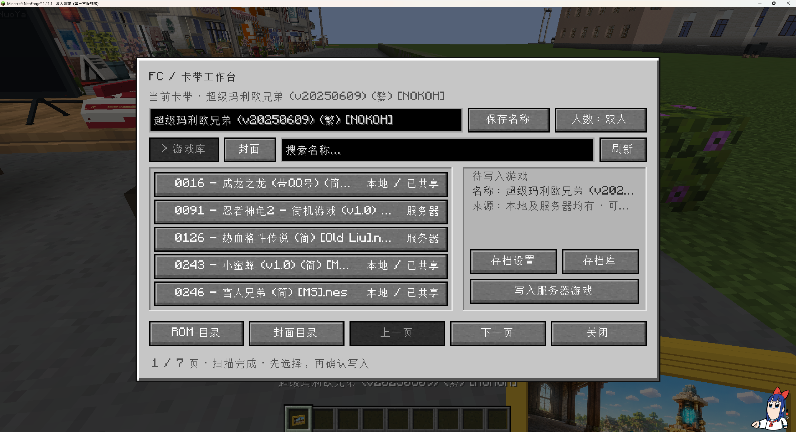

参考要点：拿卡带右键老式电脑，进入居中的原版风格面板。布局从上到下为：

1. 标题、当前卡带，名称输入／保存名称／人数。
2. 游戏库／封面页签、搜索、刷新。
3. 左侧游戏列表，清楚标注本地／服务器／已共享；右侧选中项名称、来源和待写入状态。
4. 右侧存档设置、存档库、明确的写入按钮。
5. 底部 ROM 目录、封面目录、上一页、下一页、关闭；另有页数与扫描／操作结果。

制作与验收：

- 新卡带机沿用同一布局和操作，不退化成“两行按钮＋空列表”或让玩家输入路径。
- 选中只是预览；明确点击才写入。服务器已有内容用“写入服务器游戏”，需要上传的本地内容说明“上传并写入”，权限不足给原因。
- 当前卡带、待写入游戏、编辑中的名称彼此区分；搜索／分页／刷新可用，服务器超时不能装成没有游戏。
- 目录按钮与当前机型的实际扫描一致，本地列表不依赖服务器扫描成功；一个被拒绝的 ROM 不清空其他成功项。空目录、部分失败、读取失败分别显示，刷新限流不覆盖原错误。具体验收见主文档第 5、11 节。
- 显示缩放、长中文名和不同窗口大小下能正常操作；长内容可以省略，但必须能查看完整信息。

## 08 · 封面页：同一个工作台切换内容

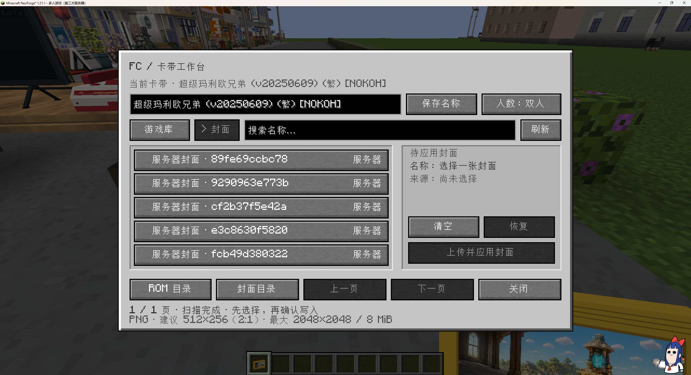

图序说明：用户顺序说明中的“存档界面参考”对应这张，但图内实际选中的是“封面”；这里按图像内容命名，不移动编号。真正的存档方式与存档库见 09、10。

参考要点：沿用图 07 的标题、名称、搜索、列表、预览和底部导航；切换到封面后，右侧变为待应用封面、清空／恢复和应用按钮，底部说明图片规格。

制作与验收：

- 游戏库与封面是同一工作台的两个页面，不另开风格、层级完全不同的选择器。
- 未选择时禁用应用，选择后按本地／服务器来源给出正确确认动作；服务器已有封面不要求重复上传。
- 清空／恢复／应用只作用于封面，不顺便换 ROM、删存档或重置卡带身份。
- 复用通用封面校验／缓存不等于复用某机型的专用本地路径；当前机型的“封面目录”必须与其扫描来源一致，不能只改标题而串到另一机型。
- 图中 FC 提示 PNG，建议 512×256（2:1），上限 2048×2048／8 MiB，是此截图的规格参考；实现时与当前校验一致，其他卡带按实际贴图区说明。无权限、超限、格式错误都有反馈。

## 09 · 存档设置：三种方式，明确跟谁走

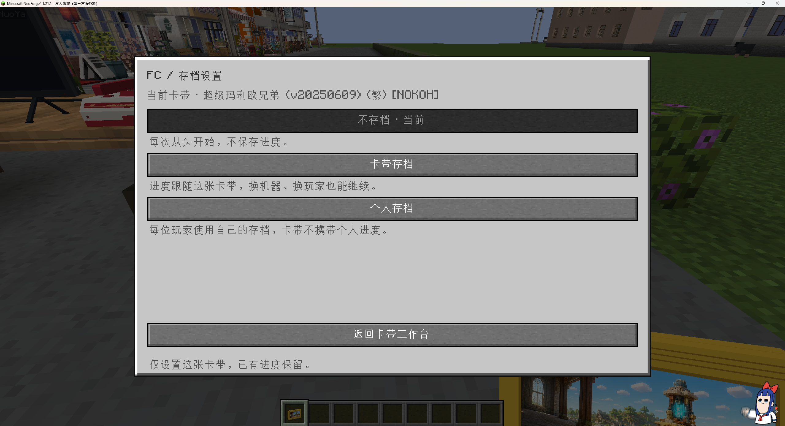

参考要点：显示当前卡带；三个完整选项各自带解释，当前选项明确标记。底部能返回工作台，并说明仅设置当前卡带、已有进度保留。

| 选项 | 玩家应理解的含义 |
| --- | --- |
| 不存档 | 每次从头开始，不保存／恢复；切换到此项不直接删除历史进度。 |
| 卡带存档 | 进度跟这张卡，换机器、换玩家仍可继续；不是机器档。 |
| 个人存档 | 玩家用自己的进度，转交卡带不把个人档一起给别人。 |

制作与验收：这些是每张卡的选择，不是同名游戏的全服开关。普通玩家按权限设置自己的卡，不为选保存方式要求 OP。“个人”是归属，“仅本机”是储存／运行范围，不能拿私人本机文件冒充服务器个人档。实际保存类型、槽位额度、格式兼容及失败保护沿用主文档第 6 节。

## 10 · 存档库：管理真正存在的进度

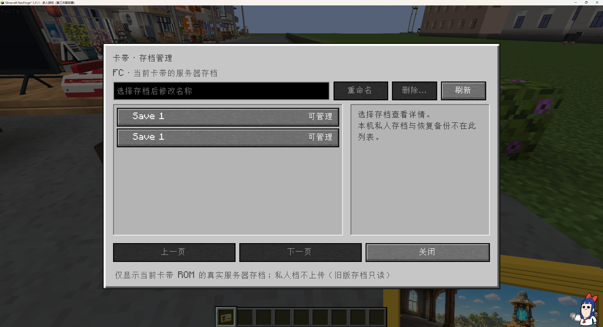

参考要点：标题与副标题说明当前机型和存档范围；顶部有名称输入、重命名、删除、刷新；左侧是真实存档列表及权限标记，右侧是所选项详情，底部有分页和关闭。

制作与验收：

- 存档库与图 09 的保存方式设置是两个不同功能，不能用一个模式按钮替代整个存档库。
- 只列当前范围和玩家有权查看的真实进度。截图明确区分服务器档与本机私人档／恢复备份，不能混成同一份。
- 选择后可查看所属游戏、归属、槽位／身份及实际可用信息；同名项仍能区分，不能按显示名删错档。
- 重命名不改变保存身份；删除必须确认、服务端校验权限；没有权限或没有选中时禁用并说明。刷新、翻页和返回都不能触发加载或删除。
- 旧格式只读时标明原因，不伪装成可覆盖。截图中的两条“Save 1”不要求新建两个重名档。

## 11 · 开局选择存档：空槽与已有进度分开

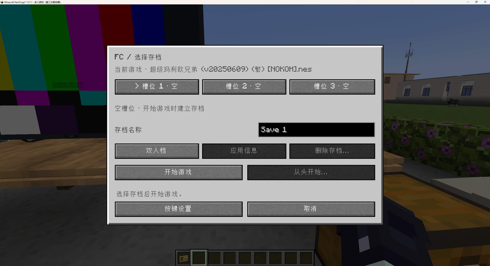

图序说明：用户希望以此参考“有存档时的界面”，但本图实际显示三个空槽。以它作为选择页布局基准；已有进度的内容与按钮状态必须按真实数据补齐。

参考要点：顶部游戏名；横排槽位与当前选择；中部槽位状态、存档名称、单／双人信息、应用信息和删除入口；下方开始游戏／从头开始，再下方按键设置／取消。

制作与验收：

- 空槽明确写“空”，开始游戏时建立新档；不能把空槽显示成可继续的进度，删除等不适用操作禁用。
- 有进度时显示实际档名及可用详情，提供继续和明确的从头开始路径；删除／重开按主文档保护旧好档，不因点进页面就覆盖。
- 按模式和归属显示真正可用的槽位：图中的三个槽不是给每种核心、每款游戏无条件新发三个槽。FC 个人总槽位与卡带随卡进度的区别不能因套布局而改变。
- 不存档模式不强弹选槽。单／双人信息不能把原本单人游戏变成双人；按键设置走公共入口，取消不启动或写坏档。
- 本图不作为“已有存档加载通过”的证据；那一状态必须另做运行验收。

## 12 · 家用机设置：共用布局，不另做简化替代页

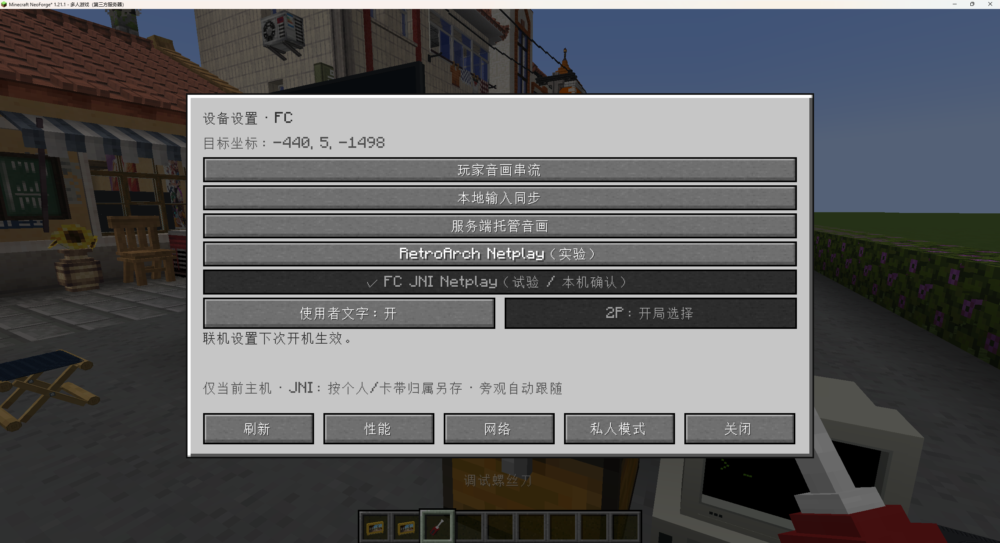

参考要点：螺丝刀右键进入“设备设置 · 机型”。顶部目标坐标；中部按组列出运行方式、当前选中项及使用者文字／2P 加入设置；下方说明生效时机、运行器与存档／旁观概况；底部刷新、性能、网络、私人模式、关闭。

制作与验收：

- 同类家用机共享相同的界面结构、术语和入口意义；应逐项接通适用的设置能力，不能用一页私人诊断替代公共设备设置。
- 玩家音画串流、本地输入同步、服务端托管、Netplay 属于运行方式；JNI 是运行器信息，不混为一个维度。图中的历史实验入口和“本机确认”字样不要求永久照搬。
- 模式按真实能力、服务器许可显示可用性；缺项明确标出原因与尚未完成范围，不默默换模式、不用假按钮宣称已支持。
- 逐项区分当前已选、尚未实现、服务器禁用、无权限、运行中限制及请求失败。“运行模式全灰、底部可点”不等于鼠标失效；若只接私人单人，必须标阶段缺口，不能仅解锁按钮或沿用 FC 布局就算完成。已可用的本机设置／诊断／返回仍须清楚可达。
- 2P／加入和使用者文字适用时保留；修改影响谁、何时生效要清楚，关闭菜单不关机。旁观者自动跟随实际会话，不要求再手选 JNI。
- 性能／音画、网络、控制和运行环境／复制诊断等完整入口按主文档第 8 节提供；全服策略仍在 OP 管理终端，不能因本图没有终端就省略。
- 螺丝刀权限在服务端检查；不因客户端出现按钮就允许非 OP 修改。小窗口、不同 GUI 缩放、禁用说明与返回路径一并验收。

## 使用这组图验收新机器

先读主文档的完整动作清单，再按 01～12 对照适用项。每项记录“通过／未通过／不适用及原因”，不要只比较截图颜色和排版。

- 家用卡带机：本图集 12 项均要逐项核对，型号差异只改变相应外观与真实能力，不省掉公共体验。
- 掌机：复用卡带、工作台、存档和设置的适用规则；手持放大、放下不关机、Shift＋右键电源另按主文档，不能套桌面主机领取手柄的动作。
- 街机：不强行套卡带或可领取家用手柄，但电源／提示／动画／可见连接／存档／配置一致性的原则仍适用；投币、组柜、空席策略单独验收。
- 检查取还、开关、按键、连接、保存、重进世界和双客户端所见；一张静态截图或编译成功不能标记这些行为通过。

后续补图继续编号并注明新增或替代关系，保留旧参考依据；最新明确需求覆盖旧布局时同步主文档，避免另一台机器又各做一套。
